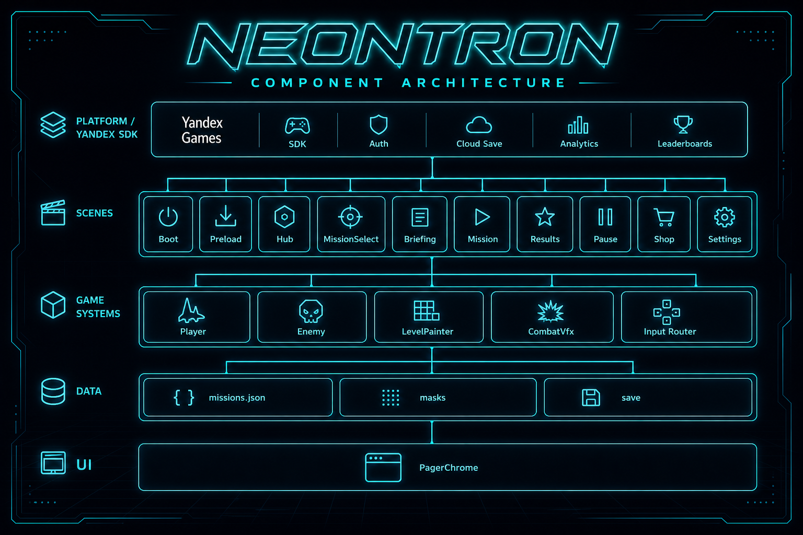
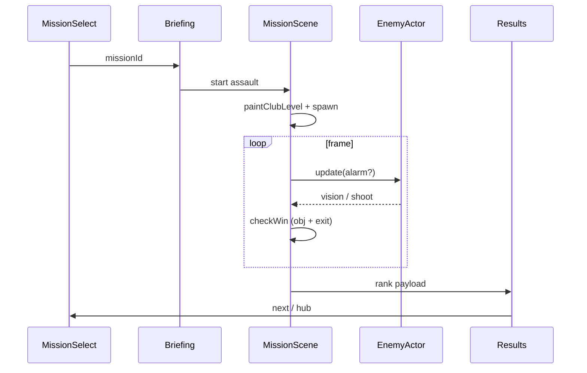
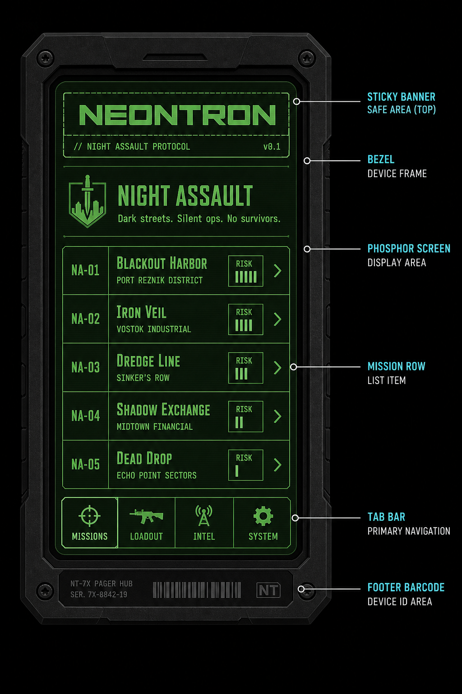
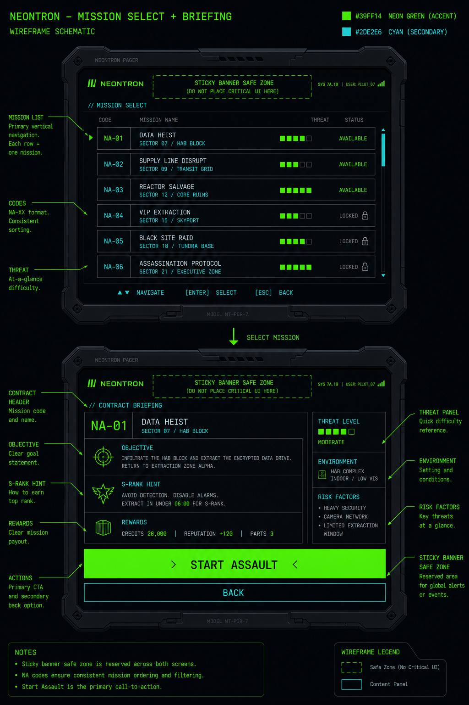
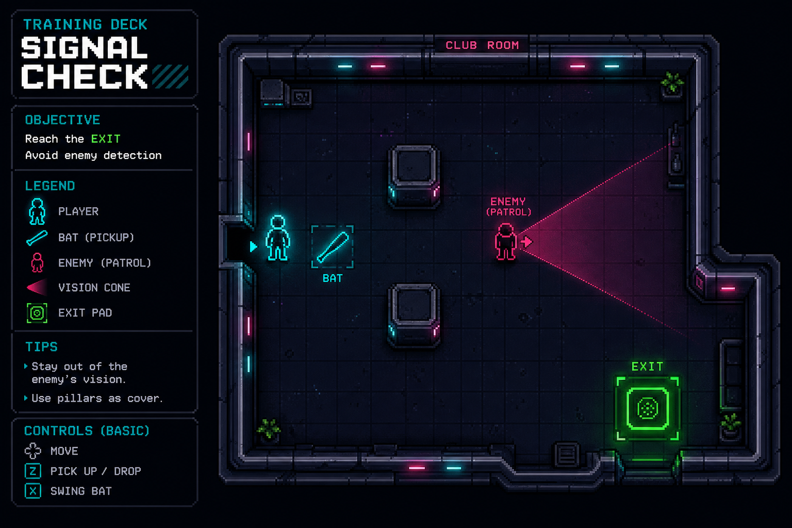
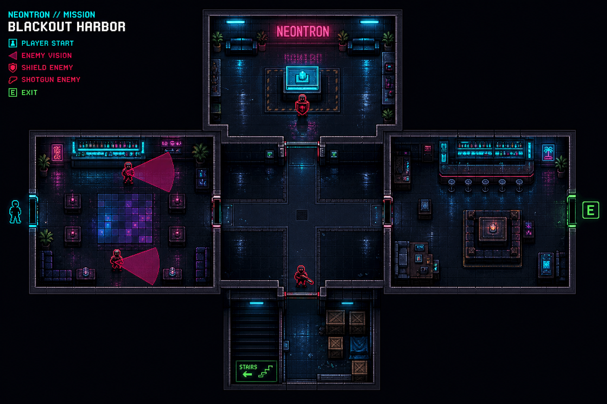
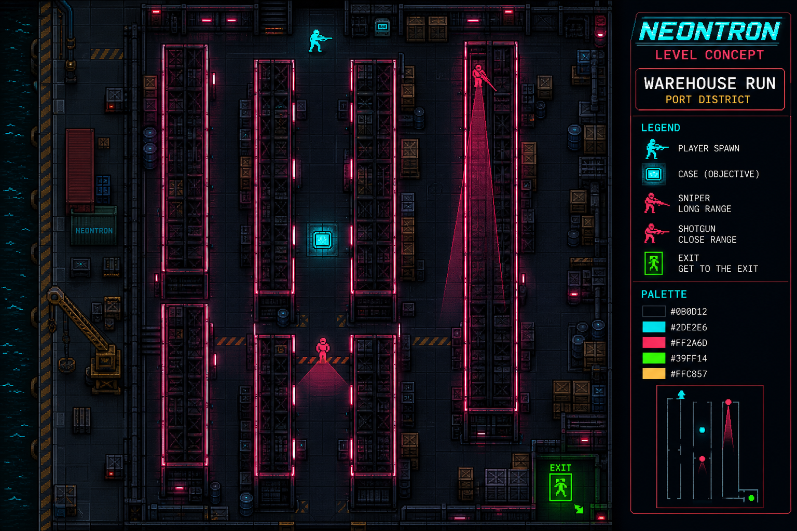
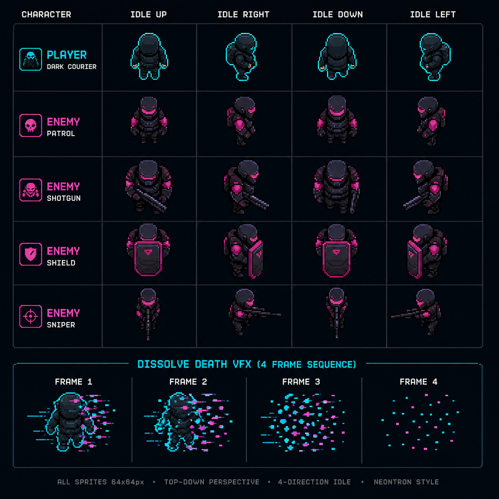
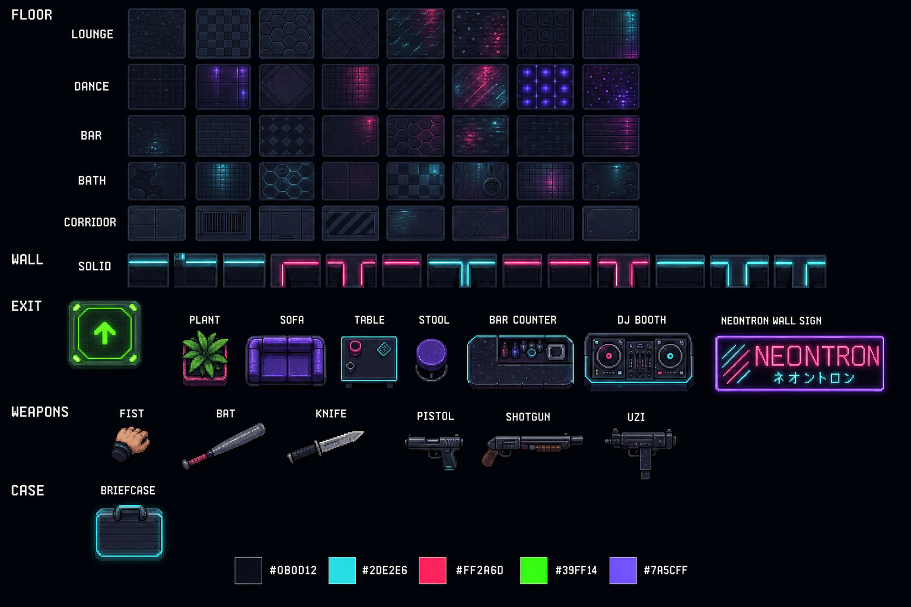

# Технический диздок LLM: «Неонтрон: Ночной штурм»

**Документ:** TDD-NEONTRON-LLM  
**Версия:** 2.0  
**Дата:** 17.07.2026  
**Статус:** production bible для LLM-агентов и художников  
**Связанные документы:**
- Продуктовый GDD: [`../GDD-NEONTRON.md`](../GDD-NEONTRON.md)
- Mood frames: [`../visual-style/README.md`](../visual-style/README.md)
- План производства: [`../LLM_PRODUCTION_PLAN.md`](../LLM_PRODUCTION_PLAN.md)
- Референсы этого пакета: [`./refs/`](./refs/), [`./wireframes/`](./wireframes/), [`./prompts/`](./prompts/)

> **Как пользоваться этим файлом**  
> 1. Разделы `§0–§3` — общий контекст (читать всем агентам один раз).  
> 2. Разделы `§4–§6` — архитектура, UI, уровни (source of truth для кода).  
> 3. Раздел `§7` — арт-пайплайн и **готовые промпты** (копировать целиком).  
> 4. Раздел `§8` — **Agent Cards**: каждый блок = отдельный запрос к LLM-агенту.  
> 5. Не смешивать задачи: один Agent Card = один PR / один пакет ассетов.

---

## 0. Саммари контекста чата (что уже сделано в репо)

### 0.1. Продукт
Top-down combat-arcade в духе Hotline Miami для **Яндекс Игр** (Phaser 3 + Vite + TypeScript). Бренд: **NEONTRON / Неонтрон: Ночной штурм**. Сеттинг: ночной порт **Нью-Рэйл**, контракты приходят на пейджер.

### 0.2. Что реализовано в коде (source of truth рантайма)
| Область | Состояние |
|---|---|
| 14 миссий | `tut_01..03`, `plat_01..08`, `port_01..03` — пересобраны с валидацией связности |
| Бой | one-hit, alarm→перестрелка, конусы/пули режутся стенами, щит с фланга |
| Управление | WASD+мышь / twin-stick mobile (`?mobile=1`) |
| Мета-UI | пейджер (`PagerChrome`): Hub / Missions / Briefing / Results / Shop / Settings / Pause |
| Типографика | Orbitron + Exo 2 + JetBrains Mono (self-hosted) |
| Объективы | `clear`/`silent`/`timed` = всех + EXIT; `vip` = только VIP + EXIT; `extract` = кейс + EXIT |
| Платформа | mock SDK, ads/IAP stubs, sticky padding, LoadingAPI/GameplayAPI hooks |
| Сборка | `npm run build && npm run pack:yandex` → `release/neontron-yandex.zip` |

### 0.3. Главные проблемы, которые этот TDD закрывает
1. **Арт сейчас «сшит из 4 mood-картинок»** — нет поуровневых визуальных брифов и sprite contracts.  
2. **Уровни логичны в JSON, но визуально однотипны** — один набор тайлов на все районы.  
3. **UI ближе к GDD, но без вайрфреймов/компонентной карты** для следующих агентов.  
4. **Нет атомарных промптов** — агенты получают размытые задачи и ломают консистентность.

### 0.4. Целевой результат этого документа
Любой LLM-агент, получив **один Agent Card** + этот контекст, выдаёт артефакт, который:
- кладётся в указанный путь;
- соблюдает палитру/нейминг/размер;
- не ломает Phaser-контракты;
- проходит чеклист DoD внизу карточки.

---

## 1. Canon lock (нельзя менять без отдельного решения)

### 1.1. Палитра
| Роль | HEX | Использование |
|---|---|---|
| Asphalt BG | `#0B0D12` | фон мира, UI chrome |
| Cyan neon | `#2DE2E6` | игрок outline, бренд, интерактив |
| Magenta neon | `#FF2A6D` | враги, конусы, опасность |
| Violet | `#7A5CFF` | редкий акцент декора |
| Phosphor | `#39FF14` | текст пейджера, EXIT |
| Amber | `#FFC857` | VIP, предупреждения, риск HIGH |
| Text | `#E8EEF8` | основной UI текст |
| Muted | `#8B93A7` | вторичный текст |

**Запрещено в промптах:** фиолетово-белые AI-gradient UI, тёплый cream `#F4F1EA` + terracotta, broadsheet newspaper layout, реалистичная кровь, gore.

### 1.2. Шрифты
| Токен | Семейство | Где |
|---|---|---|
| `fontDisplay` | Orbitron Bold | NEONTRON brand |
| `fontUi` | Exo 2 (400/600/700) | заголовки, кнопки, RU/EN |
| `fontMono` | JetBrains Mono | коды миссий, риск, таймкоды |

Файлы: `public/fonts/*` + `neontron.css` (только relative URLs).

### 1.3. Техстек
- TypeScript, Vite 6, Phaser 3.87, Arcade Physics  
- Сцены: Boot → Preload → Hub → MissionSelect → Briefing → Mission → Results (+ Pause/Shop/Settings)  
- Данные миссий: JSON из `npm run build:missions` (`scripts/build-missions.mjs`)  
- i18n: `public/i18n/{ru,en}.json` (ключи зеркальные)

### 1.4. Возраст 12+
Нейтрализация = **глитч/неон/осколки**, не кровь. Враги — маски/силуэты. Нет детей, животных-жертв, политики, мата.

---

## 2. Карта компонентов (архитектура)



### 2.1. Слои

```
┌─────────────────────────────────────────────────────────┐
│ PLATFORM  src/platform/yandex.ts                        │
│  SDK init | stickyPadding | LoadingAPI | GameplayAPI    │
│  pause/resume | lang | mock vs production               │
└───────────────────────────┬─────────────────────────────┘
                            │
┌───────────────────────────▼─────────────────────────────┐
│ SCENES  src/scenes/*                                    │
│  Boot Preload Hub MissionSelect Briefing Mission        │
│  Results PauseOverlay Shop Settings                     │
└───────────┬─────────────────────────────┬───────────────┘
            │                             │
┌───────────▼───────────┐     ┌───────────▼───────────────┐
│ UI  src/ui/PagerChrome│     │ GAME  src/game/*          │
│  mountPagerChrome     │     │  Player Enemy LevelPainter│
│  uiText pagerButton   │     │  CombatVfx SpriteFactory  │
│  missionCode/Title    │     │  CharacterAnims           │
└───────────────────────┘     └───────────┬───────────────┘
                                          │
┌─────────────────────────────────────────▼───────────────┐
│ DATA  src/data/*  + public/assets/*  + public/i18n/*    │
│  missions/*.json  masks.ts  sprites/ audio/ fonts/      │
└─────────────────────────────────────────────────────────┘
┌─────────────────────────────────────────────────────────┐
│ SERVICES  ads/ iap/ save/ audio/ input/                 │
└─────────────────────────────────────────────────────────┘
```

### 2.2. Таблица файлов ↔ ответственность

| Путь | Владелец | Можно трогать когда |
|---|---|---|
| `src/ui/PagerChrome.ts` | UI agent | вайрфреймы §5 |
| `src/scenes/MissionScene.ts` | Gameplay agent | бой/win/HUD |
| `src/game/Enemy.ts` | Combat agent | AI/stats |
| `src/game/LevelPainter.ts` | Art-integration agent | новые тайлы/зоны |
| `src/game/SpriteFactory.ts` | Art-integration agent | ключи текстур |
| `src/game/CharacterAnims.ts` | Anim agent | sheet layout |
| `scripts/build-missions.mjs` | Level agent | геометрия/роуты |
| `src/data/missions/*.json` | **только** через builder | никогда руками без нужды |
| `public/assets/sprites/**` | Art agent | PNG contracts §7 |
| `public/i18n/*.json` | Copy agent | тексты, зеркало RU/EN |
| `docs/tech-design/**` | Docs agent | этот пакет |

### 2.3. Поток рантайма миссии



---

## 3. Контракты данных (для кодовых агентов)

### 3.1. MissionDef
```ts
{
  id: string;              // tut_01 | plat_03 | port_02 ...
  chapter: 0|1|2;          // tutorial | Plat | Port
  objective: 'clear'|'vip'|'extract'|'silent'|'timed';
  playerSpawn: [x,y];
  exit: [x,y];
  tileSize: 32;
  width: number; height: number;
  walls: [x,y][];
  enemies: {
    type: 'patrol'|'shotgun'|'shield'|'sniper';
    x: number; y: number;
    route?: [x,y][];
    facing?: number;       // degrees: 0E 90S 180W 270N
    vip?: boolean;         // required for objective vip
  }[];
  weapons: { type: 'bat'|'knife'|'pistol'|'shotgun'|'uzi'; x; y }[];
  caseItem?: [x,y];        // required if extract
  briefingKey: string;
  sRankRules: { maxDeaths: number; maxTimeSec: number; noAlarm?: boolean };
}
```

### 3.2. Win rules (рантайм)
| objective | Победа |
|---|---|
| `extract` | `hasCase && atExit` (убивать не обязательно) |
| `vip` | все `vip:true` мертвы && `atExit` |
| `clear` / `silent` / `timed` | все враги мертвы && `atExit` |

### 3.3. Текстурные ключи Phaser (не переименовывать без миграции)
См. `SpriteFactory.SPRITE_FILES` и `CharacterAnims.ANIM_SHEET_FILES`.  
Новый ассет = (1) PNG в `public/assets/sprites/...` (2) запись в map (3) fallback в `ensureFallbackTextures`.

---

## 4. UI — вайрфреймы и компонентная карта

### 4.1. Референс-вайрфреймы



### 4.2. ASCII wireframe — Pager shell (все мета-экраны)

```
┌──────────────────────────────────────┐
│ ░░░░░ STICKY BANNER SAFE (Yandex) ░░ │  ← stickyPaddingPx (~90)
├──────────────────────────────────────┤
│ ╭──────── BEZEL / DEVICE FRAME ────╮ │
│ │  ┌──── PHOSPHOR SCREEN ────────┐ │ │
│ │  │  NEONTRON          (Orbitron)│ │ │
│ │  │  // PROTOCOL     v0.1 (mono) │ │ │
│ │  │  ─────────────────────────── │ │ │
│ │  │  TITLE (Exo 2 / phosphor)    │ │ │
│ │  │  subtitle mono               │ │ │
│ │  │                              │ │ │
│ │  │  [ CONTENT SLOT ]            │ │ │
│ │  │                              │ │ │
│ │  │  ─────────────────────────── │ │ │
│ │  │  [◎MIS] [▣LOAD] [☰INT] [⚙SYS]│ │ │
│ │  └──────────────────────────────┘ │ │
│ ╰──────────────────────────────────╯ │
└──────────────────────────────────────┘
```

### 4.3. Компоненты UI (атомы → организмы)

| ID | Компонент | Файл/функция | Состояния |
|---|---|---|---|
| `U-01` | `PagerShell` | `mountPagerChrome` | tab active, sticky |
| `U-02` | `BrandLockup` | Orbitron + glow cyan | static |
| `U-03` | `SectionTitle` | green glow | with/without subtitle |
| `U-04` | `MissionRow` | MissionSelect | locked/open/cleared |
| `U-05` | `RiskBadge` | LOW/MED/HIGH/CRIT | color map |
| `U-06` | `PagerButton` | solid / outlined | hover alpha |
| `U-07` | `PagerPanel` | stroke + corner crosses | — |
| `U-08` | `TabBar` | 4 tabs + icons | active caret |
| `U-09` | `HudCombat` | MissionScene text | alarm/case/exit hints |
| `U-10` | `PausePanel` | PauseOverlay | — |
| `U-11` | `ResultsRank` | giant rank glyph | S vs other |
| `U-12` | `MaskCard` | ShopScene | owned/equipped |

### 4.4. Экраны — content slots

| Экран | Tab | Content |
|---|---|---|
| Hub / Intel | intel | SIGNAL STABLE, currencies, CTA missions/mobile |
| Mission Select | missions | paginated MissionRows (5/page) |
| Briefing | missions | title, body, objective, S hint, Start/Back |
| Results | missions | rank, stats, RV, next/retry/hub |
| Shop / Loadout | loadout | MaskCards + IAP |
| Settings | system | lang, mute, cloud CTA |
| Pause | — | overlay mini-pager |

### 4.5. Spacing tokens (логические)
- Screen inset: ~7% frame  
- Content pad: 10–12px  
- Mission row H: 48–52px  
- Tab H: 52–56px  
- Touch target ≥ 44px  

---

## 5. Библия уровней (как они должны выглядеть)

> Сейчас рантайм красит **один club tileset** на всё. Цель: у каждого района свой **биом**, у каждой миссии свой **читаемый floor plan** (не «коробка с шумом»).

### 5.1. Биомы районов

| Район | Chapter | Материал пола | Стены | Свет | Декор |
|---|---|---|---|---|---|
| **TRAINING DECK** | 0 | тёмный мат, простая плитка | гладкие, мало неона | мягкий cyan | минимум props |
| **DISTRICT PLAT** | 1 | lounge/bar клуба, мокрый блик | neon edge magenta/cyan | вывески | диваны, бар, растения |
| **PORT ZARYA-13** | 2 | бетон, металлические панели | стеллажи, трубы | холодный cyan + amber lamps | контейнеры, краны (prop) |

### 5.2. Общие правила левел-арта
1. **Читаемость силуэтов > красота.** Игрок всегда с cyan outline.  
2. **Конус всегда виден** (magenta 30–40% alpha), честно режется стенами.  
3. **3 маршрута** на миссиях chapter≥1: safe / aggression / style.  
4. **Двери и чоки** — игровые события (shotgun faces door).  
5. **EXIT** — phosphor pad, всегда достижим flood-fill от spawn.  
6. Не собирать уровень «из 4 картинок»: сначала **план**, потом **биом-тайлы**, потом **props**, потом **lighting**.

### 5.3. Миссия за миссией

#### TUT_01 — SIGNAL CHECK
  
**Учит:** движение, подбор биты, удар сзади, EXIT.  
**План:** один зал + 2 ряда пилонов; патруль спиной к входу.  
**Вид:** Training Deck, почти пусто, один NEONTRON strip.  
**Динамика:** нет маршрута у врага (idle).  
**DoD визуала:** игрок видит конус и спину врага за ≤3 секунды.

#### TUT_02 — REAR ENTRY
**Учит:** конус + тайминг.  
**План:** центральная «будка» с E/W дверями; патруль ходит N–S.  
**Вид:** Training + первая барная стойка сбоку.  
**Динамика:** route loop; игрок ждёт спину или фланкует.

#### TUT_03 — CASE DRILL
**Учит:** extract + shotgun choke.  
**План:** 3 вертикальные зоны (фойе | кейс | выход); северный bypass; южная дверь = дробовик.  
**Вид:** переход Training→Plat (появляются lounge tiles).  
**Динамика:** патруль вокруг кейса; дробовик idle на дверь.

#### PLAT_01 — FIRST ADDRESS
**Фантазия:** первый «настоящий» адрес.  
**План:** 3 отсека, двери N (быстро) и S (безопасно); дробовик в среднем.  
**Вид:** lounge floors, диваны у стен, cyan strips на дверях.

#### PLAT_02 — CHOKE POINT
**Фантазия:** «не ломись в дверь».  
**План:** центральный killbox; W-дверь под дробовиком; боковой путь под снайпером.  
**Вид:** dance floor в центре, тёмный коридор снайпера.

#### PLAT_03 — BLACKOUT HARBOR (GDD App A)
  
**Фантазия:** эталонный extract.  
**План:** фойе → vault с кейсом+щитом → южный choke дробовика → правый patrol wing → EXIT.  
**Вид:** порт+бар гибрид; вывеска NEONTRON; мокрый пол.  
**S:** noAlarm.

#### PLAT_04 — VIP SHADOW
**Фантазия:** убить цель, уйти.  
**План:** фойе с патрулём; длинный зал со снайпером; кабинет VIP (amber underglow).  
**Вид:** офис за клубом — более «холодные» плитки, янтарь у VIP.

#### PLAT_05 — WET DOCK
**Фантазия:** тишина.  
**План:** два вертикальных divider’а, пересекающиеся маршруты.  
**Вид:** док — металлический пол, лужи (overlay), мало мебели; **только melee pickups**.  
**S:** noAlarm.

#### PLAT_06 — KNIFE PROTOCOL
**Фантазия:** кубы-лабиринт.  
**План:** 4 кабины 2×2 с дверями; дробовик на восточном choke.  
**Вид:** office cubicles внутри клуба (низкие стенки, читаемые проходы).

#### PLAT_07 — GRID SWEEP
**Фантазия:** три полосы.  
**План:** lanes L/C/R; центр aggression (shotgun+shield); края stealth.  
**Вид:** максимальный Plat-декор, бар слева, dance центр, lounge справа.

#### PLAT_08 — PLAT FINALE
**Фантазия:** кейс на время.  
**План:** vault в центре, VIP+case, shotgun south, sniper east, exit SE.  
**Вид:** «премиум» клуб — denser neon, violet strips редко.  
**S clock:** 50s.

#### PORT_01 — ZARYA GATE
**Фантазия:** вход в порт.  
**План:** vault глубже, больше патрулей, sniper у EXIT.  
**Вид:** первые контейнерные props, металлический пол.

#### PORT_02 — WAREHOUSE RUN
  
**Фантазия:** стеллажи = стены.  
**План:** 3 aisle walls с gap’ами на y=5/9/13; case mid; snipers long LOS.  
**Вид:** warehouse biome полный.

#### PORT_03 — PORT STORM
**Фантазия:** финал главы.  
**План:** 4 pocket rooms с дверями; dual shotgun; shield; open connectors.  
**Вид:** смесь warehouse + neon rain light shafts (VFX overlay).

### 5.4. Легенда авторинга (builder)
См. `scripts/build-missions.mjs`.  
Символы: `# . P X C b k p g u e s h H n`  
Маршруты только через `enemyMeta['x,y']`.  
После правок: `npm run build:missions` (0 orphans, perimeter sealed).

---

## 6. Арт-система: от референса к файлу в билде

### 6.1. Пирамида (обязательный порядок)
1. **Mood** (уже есть в `docs/visual-style/`) — тон мира.  
2. **Biome kit** — уникальные floor/wall/prop для Training / Plat / Port.  
3. **Actor kit** — player + 4 enemy + down + dissolve.  
4. **Anim sheets** — 8 направлений × walk/idle (минимум 4 dir).  
5. **Level paint rules** — LevelPainter зоны по биому chapter.  
6. **Promo** — только из live canvas / финальных ассетов.

### 6.2. Техспеки спрайтов
| Ассет | Размер кадра | Sheet | Путь |
|---|---|---|---|
| Static actor | 64×64 | 1 frame | `public/assets/sprites/{name}.png` |
| Anim actor | 64×64 | 8 cols × N rows | `public/assets/sprites/anim/{name}_anim.png` |
| Tile | 32×32 | single or atlas | `floor_*.png`, `wall*.png` |
| Weapon icon | 32×32 | single | `wpn_*.png` |
| Prop | 32–64 | single | `prop_*.png` |
| UI bezel | ~1024×1536 | jpg | `public/assets/ui/pager_bezel.jpg` |

**Стиль:** retro-HD pixel, читаемые силуэты, без фотореализма.  
**Игрок:** почти чёрный + **cyan outline 2px**.  
**Враги:** маски, magenta accents.  
**VIP:** amber underglow (уже в коде).

### 6.3. Референс-листы
  


---

## 7. Промпты для визуальных ИИ (копипаст)

> Правила для всех промптов ниже:  
> - Добавляй negative: `no blood, no gore, no photorealism, no purple-pink gradient UI, no cream terracotta aesthetic, no illegible clutter, no text typos`  
> - Фиксируй palette hex.  
> - Указывай **orthographic top-down** для геймплея / **UI mock** для интерфейса.  
> - Выход клади в путь из DoD карточки.

### 7.1. MASTER STYLE BLOCK (префикс ко всем арт-промптам)

```
STYLE LOCK — Neontron: Night Assault
Game: top-down neon synth-noir combat arcade, 12+, stylized not realistic.
Palette ONLY: #0B0D12 background, #2DE2E6 cyan, #FF2A6D magenta, #7A5CFF violet rare,
#39FF14 phosphor, #FFC857 amber.
Art: retro-HD pixel / crisp game sprites, wet asphalt reflections, neon signage.
Brand wordmark NEONTRON may appear as in-world sign.
NO blood, NO gore, NO horror meat, NO children, NO political symbols.
Readability first: clear silhouettes, honest vision cones (magenta translucent).
```

### 7.2. Промпт — Key Art / Store cover

```
{MASTER STYLE BLOCK}
Create vertical key art for Yandex Games store.
Hero: courier silhouette holding glowing cyan pager, rainy New-Rail port night.
Huge neon signage NEONTRON as hero brand; smaller subtitle NIGHT ASSAULT.
Motorcycle optional in mid-ground. Bokeh city lights. No UI chrome.
Aspect 2:3. High contrast. Brand must remain if nav removed.
```

### 7.3. Промпт — Biome tileset (Plat club)

```
{MASTER STYLE BLOCK}
Produce a 32x32 top-down tile sheet for DISTRICT PLAT nightclub biome.
Rows: floor_lounge, floor_dance, floor_bar, floor_bath, floor_corridor,
wall_solid with neon edge variants cyan/magenta/violet, exit pad phosphor green.
Subtle wet reflection, seamless tiles, labeled grid, dark background.
Output: clean atlas PNG suitable for Phaser.
```

### 7.4. Промпт — Biome tileset (Port warehouse)

```
{MASTER STYLE BLOCK}
Produce a 32x32 top-down tile sheet for PORT ZARYA-13 warehouse biome.
Metal floor panels, painted hazard stripes amber, rack wall tiles, pipe wall,
container prop tiles, grate floor, exit pad. Same palette. Labeled atlas.
```

### 7.5. Промпт — Player anim sheet

```
{MASTER STYLE BLOCK}
Top-down player sprite animation sheet, 64x64 frames, 8 columns.
Rows: idle_down, idle_up, idle_left, idle_right, walk_down, walk_up, walk_left, walk_right,
melee_swing, death_dissolve (4 frames cyan/magenta glitch shards).
Character: dark courier silhouette, cyan outline 2px, pager on belt, no face details.
Transparent background. Consistent pivot center.
```

### 7.6. Промпт — Enemy set + anim

```
{MASTER STYLE BLOCK}
Top-down enemy animation sheets, 64x64, 8 columns, transparent BG.
Four archetypes clearly different silhouettes:
1) patrol — slim mask, magenta trim
2) shotgun — bulkier, short weapon
3) shield — front plate readable from top
4) sniper — thin, long rifle
Each: idle 4-dir, walk 4-dir, shoot recoil 2 frames, down/dissolve 4 frames.
Amber variant outline note for VIP shield.
```

### 7.7. Промпт — Level concept (per mission template)

```
{MASTER STYLE BLOCK}
Orthographic top-down LEVEL CONCEPT ART for mission {MISSION_ID} — {TITLE}.
Biome: {BIOME}.
Layout description: {LAYOUT_PARAGRAPH from §5.3}.
Show: walls, doors, player cyan at spawn, enemies with magenta vision cones,
case if any, EXIT phosphor pad, 1–2 props max for readability.
Label callouts in English mono: SPAWN, EXIT, CASE, CHOKE, FLANK.
Aspect 16:9. This is a design reference for building a tilemap, not a collage.
```

### 7.8. Промпт — Pager UI hi-fi

```
{MASTER STYLE BLOCK}
Hi-fi UI mock of Neontron pager device matching wireframe.
Portrait phone. Matte black bezel with screws, cyan N logo bottom.
Phosphor green text on near-black LCD, Orbitron-like NEONTRON header,
mission list with NA-01 codes, RISK badges, 4 bottom tabs with icons.
Blurred rainy city behind device. Readable, not cluttered. No purple UI.
```

### 7.9. Промпт — Dissolve VFX strip

```
{MASTER STYLE BLOCK}
VFX strip 256x64: enemy neutralization in 6 frames.
From intact masked silhouette → glitch slices → cyan/magenta shards → empty.
No blood. Transparent BG. Pixel-friendly.
```

### 7.10. Negative prompt (универсальный)

```
blood, gore, wounds, photorealistic, 3d render cinema, anime eyes,
purple gradient UI, cream paper background, terracotta, newspaper layout,
crowded UI stickers, illegible tiny text, watermark, logo salad,
cute chibi, low contrast gray-on-gray
```

---

## 8. Agent Cards (готовые запросы к LLM-агентам)

Каждая карточка самодостаточна. Копируй блок «PROMPT FOR AGENT» целиком.

---

### AGENT CARD A1 — Level Artist: concept pack (14 missions)

**Цель:** 14 concept PNG (по одному на миссию) в `docs/tech-design/refs/levels/`.  
**Не делать:** код, JSON, UI.

````
PROMPT FOR AGENT:
You are the Level Concept Artist for Neontron: Night Assault.
Read docs/tech-design/TDD-NEONTRON-LLM.md §1, §5, §7.1, §7.7, §7.10.
For EACH mission in §5.3 generate one 16:9 top-down concept image using the
mission template prompt, substituting fields from the bible.
Save as docs/tech-design/refs/levels/{id}-{slug}.png
Also write a short LEVEL_PAINT_NOTES.md listing biome tiles needed per chapter.
DoD:
- [ ] 14 images exist
- [ ] spawn/exit/case readable
- [ ] palette lock respected
- [ ] no gore
````

---

### AGENT CARD A2 — Sprite Producer: biome kits

**Цель:** PNG тайлов Training/Plat/Port + props.

````
PROMPT FOR AGENT:
You are the Sprite Producer for Neontron.
Read TDD §1, §6, §7.3, §7.4, refs/sprite-sheet-ref-tiles-props.png.
Create three atlases:
- public/assets/sprites/biome_training.png
- public/assets/sprites/biome_plat.png
- public/assets/sprites/biome_port.png
Each 32px grid labeled. Then split/export individual files matching
SpriteFactory keys OR document new keys to add.
Update LevelPainter zone→texture mapping by chapter.
DoD:
- [ ] three biomes visually distinct
- [ ] exit/wall/floor readable at 32px
- [ ] game builds (npm run build)
- [ ] no path Cyrillic
````

---

### AGENT CARD A3 — Character Animator

````
PROMPT FOR AGENT:
You are the Character Animation Artist for Neontron.
Read TDD §6.2, §7.5, §7.6, refs/sprite-sheet-ref-actors.png,
and src/game/CharacterAnims.ts for frame assumptions (64px, 8 cols).
Produce anim sheets for player + patrol/shotgun/shield/sniper.
Replace public/assets/sprites/anim/*.png maintaining pivots.
DoD:
- [ ] walk cycles loop cleanly
- [ ] cyan outline on player preserved
- [ ] dissolve has ≥4 frames, no blood
- [ ] PreloadScene loads without missing textures
````

---

### AGENT CARD A4 — UI Implementer (pager fidelity)

````
PROMPT FOR AGENT:
You are the UI Engineer for Neontron.
Read TDD §4 and wireframes in docs/tech-design/wireframes/.
Improve src/ui/PagerChrome.ts + meta scenes to match wireframes:
hierarchy, spacing tokens, MissionRow layout, tab icons fidelity.
Do NOT invent new screens. Keep stickyPaddingPx behavior.
DoD:
- [ ] Hub/Select/Briefing/Results/Shop/Settings still navigate
- [ ] fonts Orbitron/Exo2/JetBrainsMono
- [ ] RU+EN readable
- [ ] npm run build && check:i18n
````

---

### AGENT CARD A5 — Level Designer (geometry)

````
PROMPT FOR AGENT:
You are the Level Designer for Neontron.
Read TDD §5 and scripts/build-missions.mjs.
Rebuild mission geometry so each map matches its bible plan
(3 routes where chapter≥1, shotgun chokes face doors, extracts have case).
Use enemyMeta keyed by "x,y". Run npm run build:missions until 0 errors.
Update briefing bodies in public/i18n/ru.json + en.json to match.
DoD:
- [ ] build:missions OK for all 14
- [ ] no orphan open cells
- [ ] i18n keys mirrored
- [ ] objectives match §5.3
````

---

### AGENT CARD A6 — Gameplay Systems

````
PROMPT FOR AGENT:
You are the Gameplay Engineer for Neontron.
Read TDD §3 and GDD §4.
Implement missing differentiators WITHOUT breaking Yandex rules:
- silent: optional hard soft-fail on gunfire for S (keep clear+exit win)
- timed: optional mission using objective timed with HUD countdown
- S+ rank if GDD condition specified
Keep restart <400ms. Keep 12+ VFX.
DoD:
- [ ] existing 14 missions still completable
- [ ] computeRank unit-tested or manually verified matrix
- [ ] npm run build
````

---

### AGENT CARD A7 — Platform / Yandex polish

````
PROMPT FOR AGENT:
You are the Platform Engineer for Neontron.
Read GDD §10 and TDD §0.2.
Wire real cloud save on explicit Settings button when player auth available;
ensure sticky hide in mission; verify LoadingAPI.ready and GameplayAPI.
DoD:
- [ ] mock mode still works offline
- [ ] no external network except Yandex SDK
- [ ] pack:yandex zip < 100MB, index.html at root
````

---

### AGENT CARD A8 — Copy / Narrative pager

````
PROMPT FOR AGENT:
You are the Narrative Designer for Neontron.
Write colder pager logs: briefing bodies (2–3 short lines), results flavor,
chapter intros. RU primary, EN mirror. No politics, no gore language.
Keys under briefing.* and optional pager.logs.*.
DoD:
- [ ] check:i18n passes
- [ ] each mission body matches objective fantasy in TDD §5.3
````

---

### AGENT CARD A9 — Audio

````
PROMPT FOR AGENT:
You are the Audio Designer for Neontron.
Replace hub/combat loops with final loop-friendly tracks (92 / 128 BPM),
add death sting 0.2s, footstep/door Foley hooks.
Respect mute + visibilitychange already in AudioService.
DoD:
- [ ] files in public/audio with Latin names
- [ ] no autostart before gesture
- [ ] budget check still green
````

---

### AGENT CARD A10 — QA / Moderation

````
PROMPT FOR AGENT:
You are QA for Yandex Games moderation of Neontron.
Run through docs/QA_REPORT.md checklist against current build.
Update QA_REPORT with fresh evidence. File bugs as GitHub issues list in markdown.
DoD:
- [ ] playable 10+ min path documented
- [ ] ads only in Results pause
- [ ] 12+ compliance confirmed
````

---

## 9. Definition of Done — интеграция арта в код

1. PNG в `public/assets/sprites/...` (латиница).  
2. Ключ добавлен в `SpriteFactory` / `CharacterAnims`.  
3. Fallback не маскирует пропажу в prod (dev assert optional).  
4. `LevelPainter` выбирает биом по `mission.chapter`.  
5. `npm run build` + ручной смоук 1 миссии биома.  
6. Референс положен в `docs/tech-design/refs/` с тем же id.  
7. Промпт, которым генерили, сохранён в `docs/tech-design/prompts/{id}.txt`.

---

## 10. Backlog vs GDD (не путать с багами)

| GDD хотелко | В коде сейчас | Когда брать |
|---|---|---|
| 8 Port + Roof chapter | 3 Port | после биомов Port |
| dog-drone / commander | нет | post-biome |
| throwables / EMI | нет | post-MVP |
| daily contracts | нет | LiveOps |
| S+ | тип есть, не считается | Agent A6 |
| cloud save real | stub button | Agent A7 |

---

## 11. Быстрый индекс файлов этого пакета

```
docs/tech-design/
  TDD-NEONTRON-LLM.md          ← этот файл
  README.md                    ← оглавление
  refs/                        ← визуальные референсы
  wireframes/                  ← UI wireframes
  prompts/                     ← сохранённые промпты генераций
```

---

*Конец TDD v2.0. При конфликте с устаревшим mood-only описанием побеждает этот документ + код рантайма.*
