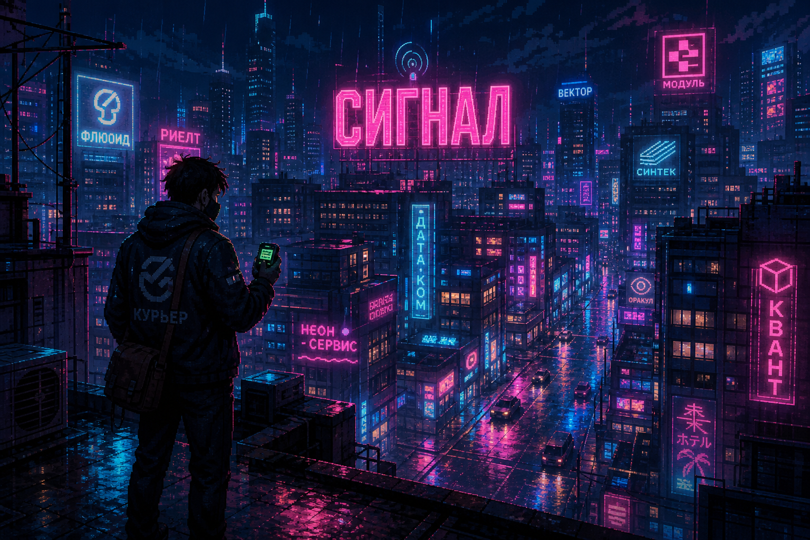
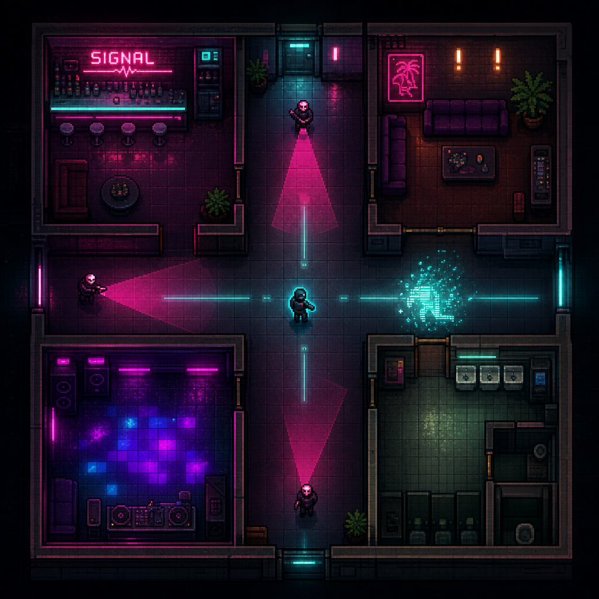
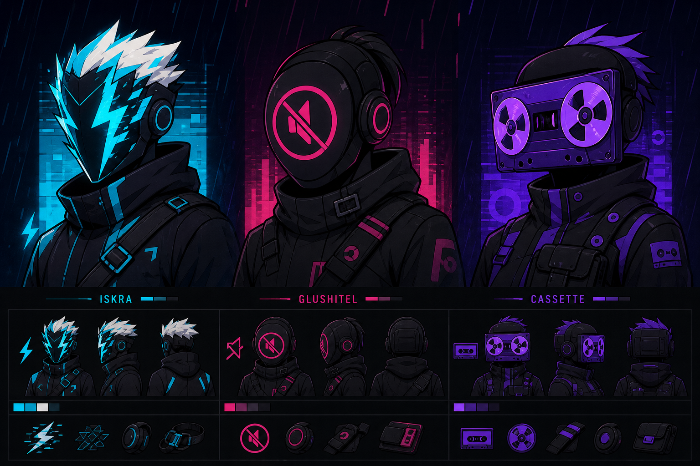
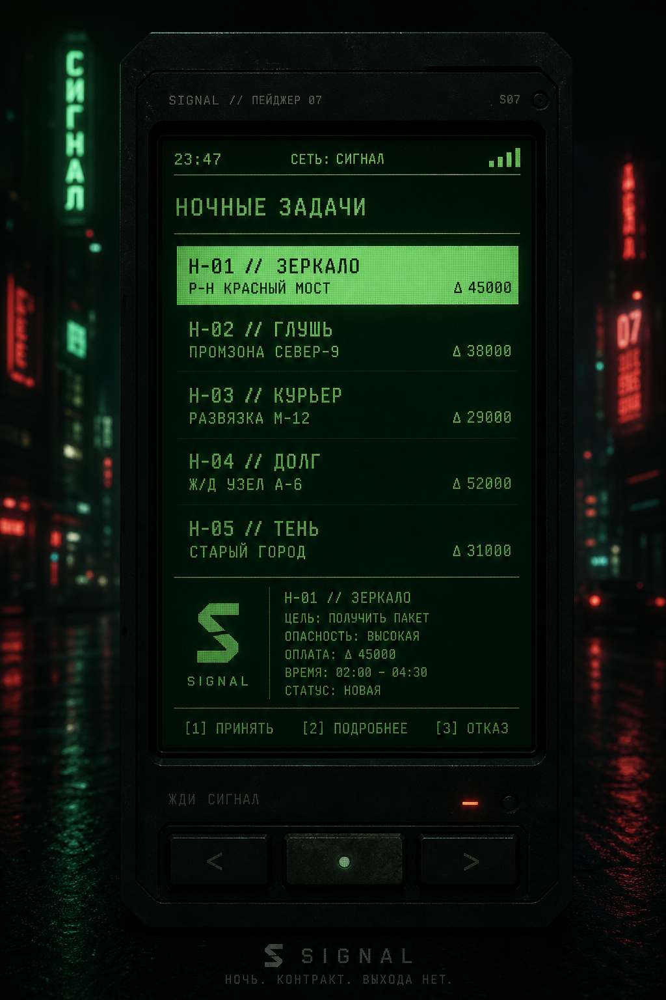
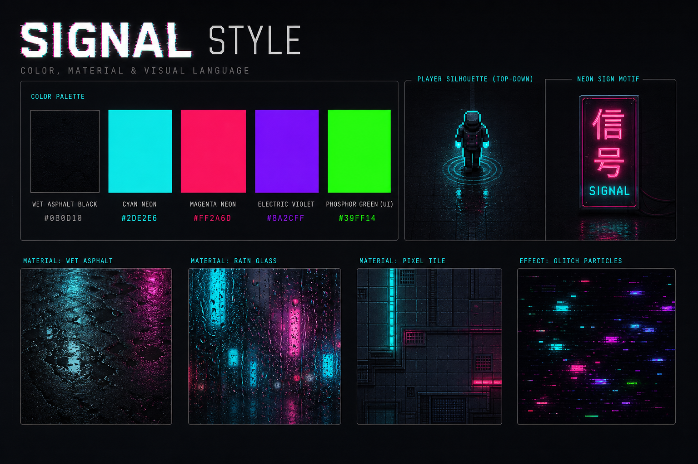

# Визуальный стиль «СИГНАЛ»

Референсы для передачи арт-дирекции вместе с [GDD](../GDD-SIGNAL.md).  
Это **не финальные ассеты билда**, а mood / style frames для художников, левел-дизайнеров и промо.

---

## 1. Key Art — мир и тон

**Что фиксируем:**
- Ночной дождливый город, мокрый асфальт, неоновые вывески
- Герой = силуэт «Курьера» с пейджером, не супергерой
- Бренд «СИГНАЛ» читается как часть мира (вывеска), не как мелкий UI
- Тон: холодный synth-noir, без фотореализма и без gore

**Использовать для:** обложки черновика, промо, питча инвестору/паблишеру, арт-брифа.

---

## 2. Top-down геймплей

**Что фиксируем:**
- Камера строго сверху, читаемый floor plan
- Игрок — тёмный силуэт с **cyan outline**
- Враги — стилизованные маски, не реалистичные лица
- **Конусы зрения** — полупрозрачный magenta
- Рывок / действие читается глитч-шлейфом
- Локации = комнаты + коридоры, не открытый open-world

**Использовать для:** левел-дизайна, HUD-минимализма, туториала «конус = смерть».

---

## 3. Личины (маски ролей)

**Что фиксируем:**
- Маски = цифровые личности, не копия чужого IP
- Три стартовых архетипа: **Искра / Глушитель / Кассета**
- Крупные графичные формы, высокий контраст
- Носятся как tech-wear аксессуар, не horror-грим

**Использовать для:** мета-прогрессии, магазина косметики, иконки персонажа.

---

## 4. VFX «нейтрализации» (12+)

**Что фиксируем (обязательно для модерации):**
- Смерть/нокаут = **глитч + неон + осколки**, не кровь
- Нет ран, луж, внутренностей, страданий
- Цвета вспышки: cyan / magenta
- Короткий читаемый FX, дружелюбен к рестарту

**Использовать для:** combat VFX bible, возрастной рейтинг 12+.

---

## 5. UI хаба — пейджер

**Что фиксируем:**
- Мета-меню = пейджер / фосфорный экран, не казуальные «карточки акций»
- Список миссий, сигнал, время, район
- Жёсткая сетка, моноширинные цифры
- Фон — размытый неон города

**Использовать для:** хаба, брифинга, daily/weekly экранов.

---

## 6. Палитра и материалы

### Базовая палитра

| Роль | Цвет | HEX (ориентир) |
|---|---|---|
| Фон / асфальт | почти чёрный | `#0B0D12` |
| Неон A | cyan | `#2DE2E6` |
| Неон B | magenta | `#FF2A6D` |
| Акцент | electric violet | `#7A5CFF` |
| UI phosphor | green | `#39FF14` |
| Предупреждение | amber | `#FFC857` |

### Материалы
- мокрый асфальт / отражения;
- пиксельная плитка интерьеров;
- стекло дождя;
- глитч-частицы нейтрализации;
- фосфорный UI пейджера.

---

## Правила арт-дирекции (коротко)

1. **Сначала читаемость боя**, потом красота неона.
2. Игрок всегда контрастен на любом полу.
3. Конус зрения честный и заметный.
4. Никакой реалистичной крови в проде.
5. Не смешивать пиксель и реалистичный 3D в одном кадре.
6. UI боя минимальный; эмоция и магазин — на экранах паузы/результата.
7. Промо должно показывать **реальный top-down геймплей**, не только key art.

---

## Как передавать вместе с диздоком

Минимальный пакет для арт/продакшн:
1. `../GDD-SIGNAL.md`
2. Эта папка `docs/visual-style/`
3. По желанию — 1 трек-референс (внешний, не в билде) в духе dark synth / industrial pulse

Этого достаточно, чтобы художник, левел-дизайнер и паблишер сходились в одном визуальном языке.
