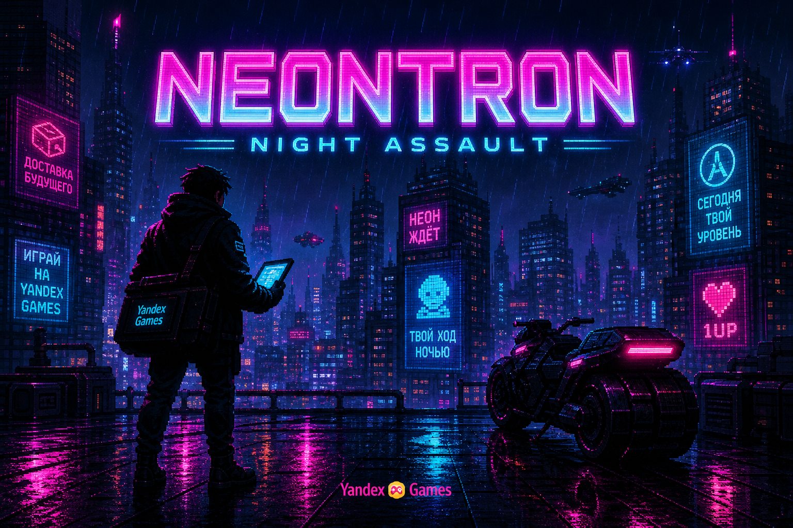
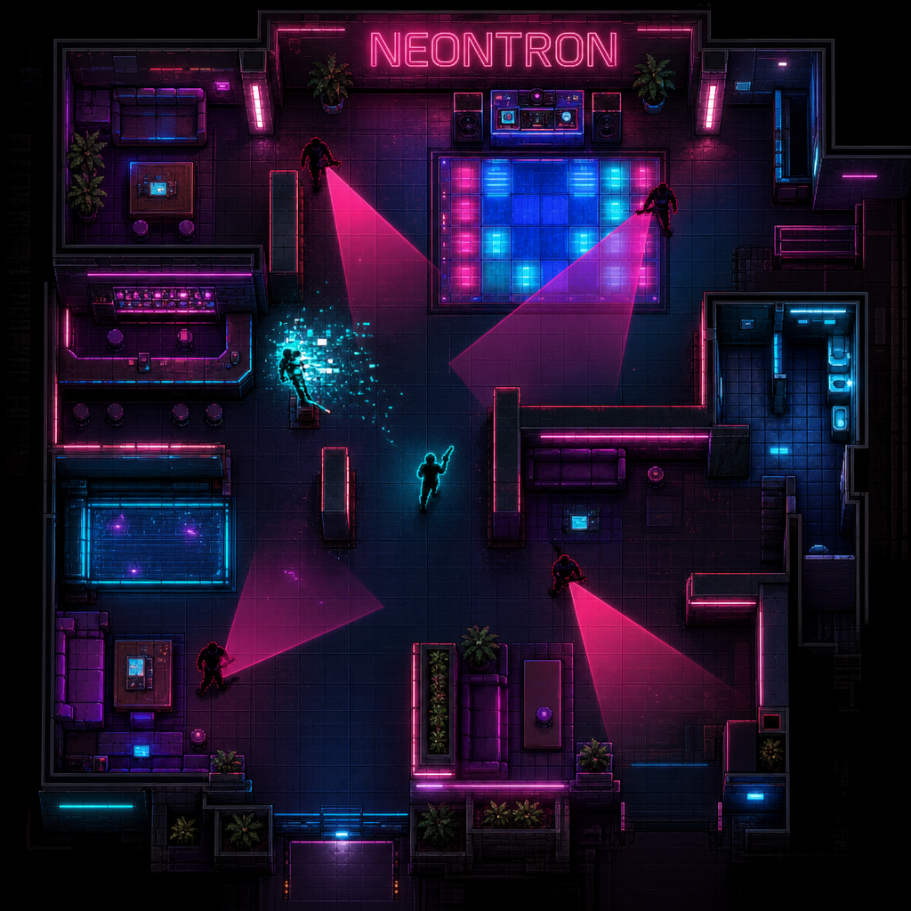
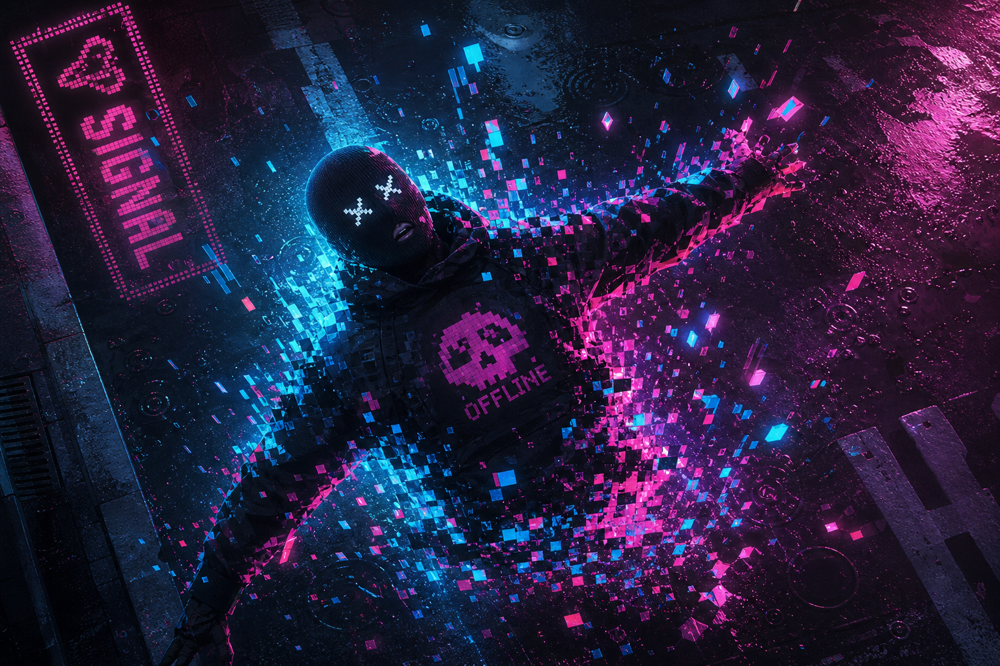
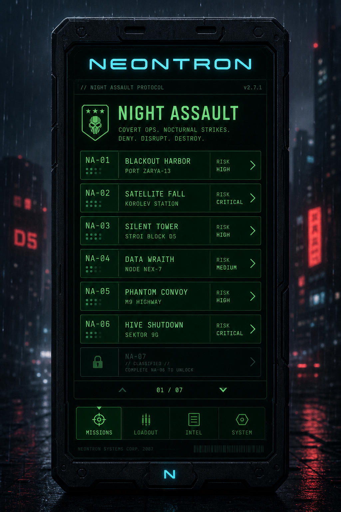
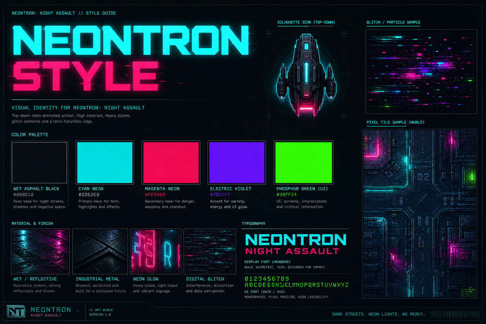

# Визуальный стиль «Неонтрон: Ночной штурм»

Референсы для передачи арт-дирекции вместе с [GDD](../GDD-NEONTRON.md).  
Это **mood / style frames**. Для производства ассетов, вайрфреймов, поуровневых концептов и LLM-агентов используйте технический пакет:

**→ [`../tech-design/README.md`](../tech-design/README.md)** / [`TDD-NEONTRON-LLM.md`](../tech-design/TDD-NEONTRON-LLM.md)

---

## 1. Key Art — мир и тон

**Что фиксируем:**
- Ночной дождливый город, мокрый асфальт, неоновые вывески
- Герой = силуэт курьера с пейджером
- Бренд **NEONTRON / Неонтрон** читается как вывеска в мире
- Подзаголовок **NIGHT ASSAULT / Ночной штурм** — вторичный слой бренда
- Тон: холодный synth-noir, без фотореализма и без gore

**Использовать для:** обложки черновика, промо, питча, арт-брифа.

---

## 2. Top-down геймплей

**Что фиксируем:**
- Камера строго сверху, читаемый floor plan
- Игрок — тёмный силуэт с **cyan outline**
- Враги — стилизованные маски
- **Конусы зрения** — полупрозрачный magenta
- Вывеска **NEONTRON** в локации как якорь бренда
- Рывок / действие читается глитч-шлейфом

**Использовать для:** левел-дизайна, HUD-минимализма, туториала.

---

## 3. Личины (маски ролей)

**Что фиксируем:**
- Маски = цифровые личности оператора Неонтрона
- Три стартовых архетипа: **Искра / Глушитель / Кассета**
- Крупные графичные формы, высокий контраст
- Tech-wear аксессуар, не horror-грим

---

## 4. VFX «нейтрализации» (12+)

**Что фиксируем:**
- Смерть/нокаут = **глитч + неон + осколки**, не кровь
- Цвета: cyan / magenta
- Короткий читаемый FX, дружелюбен к рестарту

---

## 5. UI хаба — пейджер Неонтрона

**Что фиксируем:**
- Мета-меню = пейджер с брендом **NEONTRON**
- Список ночных штурмов, сигнал, время, район
- Жёсткая сетка, моноширинные цифры
- Фон — размытый неон города

---

## 6. Палитра и материалы

### Базовая палитра

| Роль | Цвет | HEX (ориентир) |
|---|---|---|
| Фон / асфальт | почти чёрный | `#0B0D12` |
| Неон A | cyan | `#2DE2E6` |
| Неон B | magenta | `#FF2A6D` |
| Акцент | electric violet | `#7A5CFF` |
| UI phosphor | green | `#39FF14` |
| Предупреждение | amber | `#FFC857` |

---

## Правила арт-дирекции

1. **Сначала читаемость боя**, потом красота неона.
2. Бренд **Неонтрон** виден в мире (вывески, пейджер), не только в логотипе меню.
3. Конус зрения честный и заметный.
4. Никакой реалистичной крови.
5. UI боя минимальный; эмоция — на экранах паузы/результата.

---

## 7. Игровые спрайты (билд)

Ассеты рантайма лежат в `public/assets/sprites/` (top-down персонажи, тайлы, оружие, декор клуба).  
Исходные sheet'ы генерации — в `generated-sprites/`.

**Правила окклюзии в бою:**
- Конус зрения врага режется стенами (raycast по тайлам).
- Выстрелы и конус прицела игрока тоже останавливаются стенами.

---

## Пакет для передачи

1. `../GDD-NEONTRON.md`
2. `docs/visual-style/` (эта папка)
3. `../audio/` — референсные лупы саундтрека
